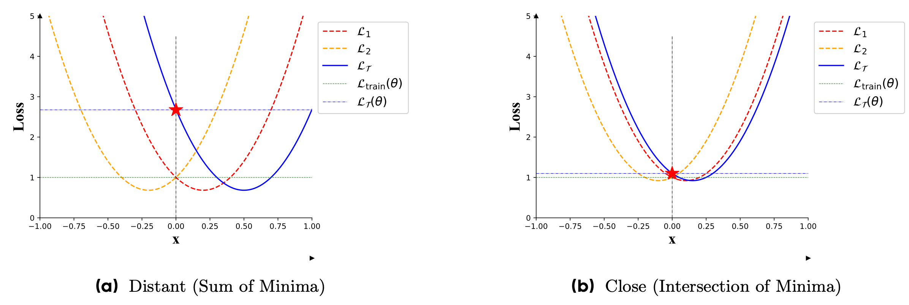
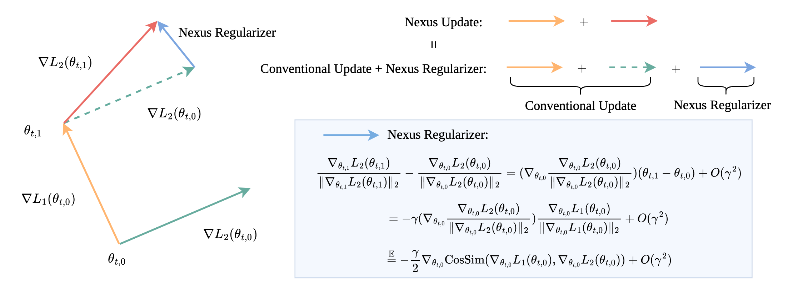








I'm a PhD student at TSAIL (Fall 2025), advised by Prof. [[Jun Zhu](https://ml.cs.tsinghua.edu.cn/~jun/index.shtml)], and closely collaborating with Prof. [[Yinpeng Dong](https://ml.cs.tsinghua.edu.cn/~yinpeng/)]. I’m currently working in Prof. [[Jingzhao Zhang](https://iiis.tsinghua.edu.cn/en/People/Faculty/ZhangJingzhao.htm)]’s lab as a rotation student. I have a keen interest in the **physics of deep learning**. My **unattainable yet motivating** dream is to elevate AI to the realm of science, making every phenomenon explainable and predictable. I believe this requires both rigorous theoretical thinking and extensive empirical observation. My preferred research paradigm involves observing phenomena, proposing multiple explanations, constructing various theories from diverse aspects, validating corollaries, and ultimately deriving solutions or methodologies. I'm eager to connect with anyone who shares this vision for AI or appreciates the same research approach.

I'm an extremely interest-driven person—I do research purely for fun. Currently, I'm extremely interested in analyzing the optimization and generalization dynamics in both toy models and LLM pretraining under controllable settings. I actively explore topics like river valley, edge of stability, central flow, tensor programs, greedy low-rank, deep linear networks, momentum and conditional gradients in LLM pretraining. Below is a selection of my previous research. To me, the ultimate compliment is simply to hear: 'Your work is interesting.'

# 📝 Implicit Bias of Closeness

Generalization is the fundamental problem in machine learning, to which I would like to devote my whole life. In deep learning, I believe generalization is **deeply entangled with optimization**, and cannot be separated from it as in the traditional bias-variance tradeoff.

I have been greatly inspired by previous work on the relationship between sharpness and generalization. In recent years, I identified another implicit bias—which I term **closeness**—that strongly correlates with generalization across various settings.

  
   

The intuition for "closeness" struck me one day while visualizing the loss landscapes of multiple tasks. Take LLM pre-training, for example: the model optimizes an averaged loss across diverse data sources. However, I realized that achieving a low total training loss isn't the whole story. As illustrated in the figure above, two completely different types of minimizers can yield the **exact same training loss**. But a minimizer that lies geometrically **"close" to all individual task minima (the intersection)** inherently captures the **shared underlying structure**, leading to **significantly better downstream generalization** than a distant minimizer (the sum).

I further discovered that this geometric closeness is strictly upper-bounded by **gradient closeness**. Intuitively, if the gradients of each loss always share the same direction, their respective minimizers must be exactly the same. Moreover, gradient closeness serves as a powerful proxy for generalization, as demonstrated by the first-order approximation:

$$\underbrace{\mathcal{L}_{\mathcal{T}}(\boldsymbol{\theta}) - \mathcal{L}_{\mathcal{T}}(\boldsymbol{\theta}- \gamma \nabla \mathcal{L}_{\text{train}}(\boldsymbol{\theta})) }_{\text{decrease of downstream loss after one GD step on training set}} = \gamma \nabla \mathcal{L}_{\text{train}}(\boldsymbol{\theta})^\top \nabla \mathcal{L}_{\mathcal{T}}(\boldsymbol{\theta}) + O(\gamma^2).$$

Thus, when I mention "closeness", it encompasses both geometric and gradient closeness. To explicitly optimize this, I proposed **closeness-aware second-order optimizers** (such as **CWA** and its recent evolution, **Nexus**). 

  
   

This optimization philosophy achieves extremely fascinating results across diverse settings:

**1. LLM Pre-training:** It achieves the **exact same pretraining loss curve** as the baseline, but delivers **significantly better downstream task generalization**.
### Nexus: Same Pretraining Loss, Better Downstream Generalization via Common Minima
**Huanran Chen**, Huaqing Zhang, Xiao Li, Yinpeng Dong, Ke Shen, Jun Zhu
- [[Arxiv](https://arxiv.org/abs/2604.09258)]

**2. Black-box Transfer Attacks:** It achieves much higher attack success rates than baselines. In this adversarial setting, models always trivially achieve **0 training loss**, meaning optimization speed is irrelevant—***generalization* is all that matters**.
### Closeness of the Local Optima: A Second Order Property Related to Generalization
**Huanran Chen**, Yichi Zhang, Yinpeng Dong, Jun Zhu
- [[ICLR2024](https://arxiv.org/abs/2303.09105)] [[Blog](https://zhuanlan.zhihu.com/p/680197033)] [[Video](https://www.bilibili.com/video/BV13W421N7mi/)]

**3. Breaking Production VLMs:** By maintaining closeness, the optimizer successfully bypassed the defenses of commercial black-box models like **Google Gemini, GPT-4V, and Bard** with a **>95% attack success rate**.
### How Robust is Google's Bard to Adversarial Image Attacks?
Yinpeng Dong, **Huanran Chen**, Jiawei Chen, Zhengwei Fang, Xiao Yang, Yichi Zhang, Yu Tian, Hang Su, Jun Zhu
- [[NeurIPSW2023](https://arxiv.org/abs/2309.11751)] [[Blog](https://zhuanlan.zhihu.com/p/2991362466)] [[Video](https://www.bilibili.com/video/BV13W421N7mi/)]

# 📝 Basin-like Loss Landscape in Deep Learning

The visualization of loss landscapes has always fascinated me. One day, while plotting the empirical loss landscapes of Large Language Models, I made a striking observation: rather than converging to sharp, isolated minima, LLMs often settle into expansive, flat "basins". This geometric property turns out to be intimately connected to how they preserve knowledge and resist perturbations.

  
   

## Unveiling the Basin-Like Loss Landscape in Large Language Models
**Huanran Chen**, Yinpeng Dong, Zeming Wei, Hang Su, Jun Zhu.
- **The Basin Phenomenon:** Discovered that LLMs exhibit remarkable parameter-space robustness to Gaussian noise, forming stable "basins" in the benchmark-driven loss landscape where capabilities do not degrade. Interestingly, the larger the model, the wider this basin becomes.
- **Implications for Fine-Tuning:** Hypothesized and experimentally validated that benign fine-tuning operating within these basins minimally disrupts existing capabilities, offering an intuitive geometric explanation for why SFT doesn't easily trigger catastrophic forgetting.
- **Theoretical Grounding:** Leveraged randomized smoothing to rigorously prove that larger basins inherently correlate with reduced performance degradation during Supervised Fine-Tuning (SFT).
- **Security & Regularization:** Analyzed how parameter-space robustness mathematically implies robustness against jailbreak attacks. Furthermore, explored regularization techniques to actively constrain SFT within these safe basins.
- [[ICLR2026](https://arxiv.org/abs/2505.17646)]  [[Blog](https://zhuanlan.zhihu.com/p/1920616505151845374)] [[No Video]]

My fascination with the geometry of neural networks traces back to my very first research project. While conceptually simpler than my current work on massive LLMs, it was the crucial spark that cultivated my interest and drove me to dedicate my research career to the profound connection between optimization and generalization.

## Bootstrap Generalization Ability from Loss Landscape Perspective
**Huanran Chen**, Shitong Shao, Ziyi Wang, Zirui Shang, Jin Chen, Xiaofeng Ji, Xinxiao Wu  
- Proposed a novel backbone, scheduler, and training paradigm specifically designed to encourage the flatness of local optima during optimization.
- Provided a unified explanation for various empirical tricks and regularizations strictly through the lens of loss landscapes.
- **Practical Recommendation:** Demonstrated that our ALRS method provides a fundamental boost to standard SGD, offering a highly recommended plug-and-play solution if you are heavily relying on vanilla SGD.
- [[ECCVW2022](https://arxiv.org/abs/2209.08473)] [[Blog](https://www.zhihu.com/question/638766873/answer/3358801861)] [[Video](https://www.bilibili.com/video/BV13W421N7mi/)]

# 📝 Diffusion Models and Robustness Certification

This line of work began during my undergraduate years. While studying diffusion models, I was struck by a fascinating counter-intuition: a purely generative model, trained solely to denoise, inherently contains all the conditional distribution information needed to perform discriminative tasks—without a single step of standard discriminative training.

## Robust Classification via a Single Diffusion Model
**Huanran Chen**, Yinpeng Dong, Zhengyi Wang, Jun Zhu  
- **Paradigm Shift:** Proposed directly utilizing a single diffusion generative model as a robust discriminative classifier, completely bypassing adversarial training.
- **Empirical Validation:** Demonstrated the inherent robustness of the diffusion classifier against both out-of-distribution (O.O.D.) data and adversarial examples.
- **Theoretical Tools:** Derived the optimal solution for diffusion models, providing a rigorous mathematical tool for analyzing their behavior.
- **Efficient Inference:** Proposed Likelihood Maximization as an efficient approximate marginal inference method.
- [[ICML2024](https://arxiv.org/abs/2305.15241)] [[Blog](https://zhuanlan.zhihu.com/p/675067562)] [[Video](https://www.bilibili.com/video/BV1sk4y1S7pv/?spm_id_from=333.337.search-card.all.click)]

Empirical robustness is intriguing, but as someone who pursues mathematical certainty, I wanted strict theoretical bounds. I realized we could elegantly bypass intractable components to derive a very tight certified guarantee for these diffusion classifiers.

## Diffusion Models are Certifiably Robust Classifiers
**Huanran Chen**, Yinpeng Dong, Shitong Shao, Zhongkai Hao, Xiao Yang, Hang Su, Jun Zhu  
- Derived two Evidence Lower Bounds (ELBOs) for log-likelihood on noisy data to construct new noised diffusion classifiers (enabling point-wise Lipschitz bounds).
- Obtained the analytical form of the gradient for diffusion classifiers, elegantly bypassing the intractable UNet Jacobian.
- Established three Lipschitzness and robustness lower bounds, providing rigorous point-wise certification.
- Achieved state-of-the-art certified robustness (e.g., 70.7% for an $\ell_2$ radius of 0.5), closing the gap to merely 20% from the empirical upper bound.
- [[NeurIPS2024](https://arxiv.org/abs/2402.02316)] [[Blog1](https://zhuanlan.zhihu.com/p/12592746504)] [[Blog2](https://zhuanlan.zhihu.com/p/690230490)] [[Video](https://www.bilibili.com/video/BV1WhV2zRE2m/)]

Later, I realized this theoretical framework wasn't limited to continuous image spaces or Gaussian noise. We could generalize the robustness guarantee to **any discrete noise distribution** in Large Language Models by reducing the randomized smoothing process to a classical knapsack problem.

## Towards the Worst-case Robustness of Large Language Models
**Huanran Chen**, Zeming Wei, Yinpeng Dong, Hang Su, Jun Zhu.
- **The Brutal Reality of White-Box:** Conducted rigorous white-box evaluations (conceptually straightforward but requiring massive engineering effort to strictly align tokens during optimization and inference). Demonstrated that existing LLM defenses, including adversarial training (AT), drop to 0% robustness under strict white-box evaluation.
- **The Knapsack Reduction:** To provide a lower bound on worst-case robustness, I focused on randomized smoothing. I reduced the calculation of certified robustness under *any* smoothing distribution to a fractal or 0-1 knapsack problem, providing a universal solver.
- **Kernel Superiority:** Theoretically proved that the uniform kernel (analogous to diffusion) strictly dominates the absorbing kernel (masked generation) in terms of robustness at the same accuracy level. Proved it is the best data-independent kernel without knowing data priors.
- **Mapping the Ceiling:** Derived a Bayesian error upper bound for the uniform kernel, mapping the theoretical ceiling of robust guarantees.
- **Symmetric Lemma:** Introduced a symmetric lemma to analyze the trading graph, enabling elegant proofs for properties like the relationship between certified robustness and vocabulary size.
- **Results:** Achieved a certified radius of 2.00 in $\ell_2$ (against a Bayesian upper bound of 2.10) and 6.57 in the suffix setting (where empirical research typically focuses on a suffix length of 20).
- [[NeurIPS2024 SafeGenAI](https://arxiv.org/abs/2501.19040)]  [[Blog](https://zhuanlan.zhihu.com/p/21266930786)] [[Video](https://www.bilibili.com/video/BV1WhV2zRE2m/)]

# 📖 Academic Experience
- *2025 - present*, PhD student at TSAIL, Tsinghua University.    Advised by Prof. Jun Zhu
- *2025 - present*, Top Seed Intern at ByteDance.

# 💻 Projects
I place a high emphasis on code quality. I ensure that my project code is modular, plug-and-play, and must be clear and understandable. This makes it convenient for users to directly import or copy parts of the code.       
I have reproduced over ten types of diffusion models such as EDM, DDIM, SDE, and DDPM, as well as over ten adversarial attacks like SSA, CWA, and VMI, and more than ten defense methods including AT and DiffPure. I hope my library can help others quickly familiarize themselves with these algorithms and facilitate their research.

- [[Adversarial Attacks package](https://github.com/huanranchen/AdversarialAttacks)]
- [[Attacks on GPT-4 and Bard](https://github.com/thu-ml/Attack-Bard)]
- [[Adversarial Attacks on Object Detection](https://github.com/VDIGPKU/T-SEA)]
- [[Landscape Visualization](https://github.com/huanranchen/Visualize-Loss-Landscape)]
- [[LLM Landscape](https://github.com/huanranchen/LLMLandscape)]

# 💼 Academic Service
P.S. Just some volunteering to show that I am happy to contribute to society (QwQ).                
Proof of my participation in these volunteer services can be verified on the respective conference websites.

- Journal Reviewer: T-PAMI, TMLR
- Conference Reviewer: ICML/ICLR/NeurIPS, AISTATS, CVPR/ECCV/ICCV

# 🔥 Links

Here you can find links to my advisors, friends, and role models. I’m always happy to connect with those who share similar research interests or hobbies!

- Advisor(s): [[Jun Zhu](https://ml.cs.tsinghua.edu.cn/~jun/index.shtml)], [[Yinpeng Dong](https://ml.cs.tsinghua.edu.cn/~yinpeng/)],  [[Jingzhao Zhang](https://iiis.tsinghua.edu.cn/en/People/Faculty/ZhangJingzhao.htm)], [[Hang Su](https://www.suhangss.me/)]
- Friends: [[Ziruo Wang](https://zerowang030221.github.io/)],  [[Zeming Wei](https://weizeming.github.io/)], [[Zhengyi Wang](https://thuwzy.github.io/)], [[Shitong Shao]()]
- Role Models: [[Kaiyue Wen](https://whenwen.github.io/)], [[Jeremy Cohen](https://jmcohen.github.io/)], [[Alex Damian](https://alex-damian.github.io/)], [[Sébastien Bubeck](http://sbubeck.com/)]

The researchers listed as my role models have produced work that I deeply admire and have learned immensely from. My goal is to create research that is equally interesting, insightful and impactful—I aspire to follow in their footsteps.

# 🔥 Personality

I'm an INTP 7w6, driven by an insatiable curiosity to explore the world, the universe, and the electrifying science behind neural networks. I’m utterly captivated by nearly all realms of scientific knowledge.

My favorite food is McDonald’s/KFC. I also thrive on climbing mountains, hiking, and cycling.

# 📧 Emails

I truly believe that great ideas and improvements come from open discussions and debates in academia. If you have any thoughts, disagreements with my work, or fresh ideas you'd like to share, I'd be really grateful to hear from you.

If you've got any questions about my research or if you've tried reaching out through GitHub issues and haven't heard back, please don't hesitate to drop me an email. I’m always here to chat or help out in any way I can.

**If you are inclined to discuss publication or citation numbers, rely on numerical indicators to quantify individuals, or compare me to others, please refrain from contacting me. I am only interested in discussing intriguing problems and insights, not metrics.**

My preferred email: huanran.chen@outlook.com; huanran_chen@outlook.com; chenhr25@mails.tsinghua.edu.cn; chenhuanran@bytedance.com; 
